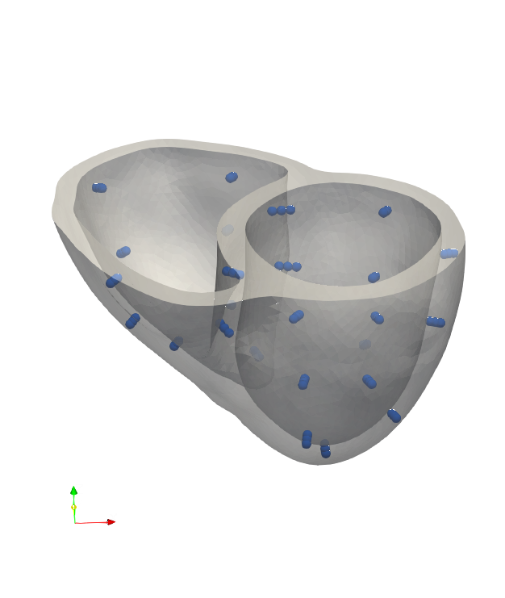

# Machine Learning for Cardiac Electrophysiology 


**If you find this repository useful, we ask that you cite our works in section [Citations](#citations).
Also, don't forget to ⭐ this repository if you find it useful!**

This repository contains the code for the [Data Science Challenge](https://data-science.llnl.gov/dsc) problem on machine learning for cardiac electrophysiology.
It contains tutorials on machine learning, as well as notebooks to get you started with the challenge. These notebooks are meant to be a starting point for the challenge, and you are encouraged to modify them as you see fit.
In particular, you are encouraged to use any machine learning framework of your choice (e.g. PyTorch, TensorFlow, JAX, etc.) and any machine learning model of your choice (e.g. neural networks, random forests, etc.).
The repository also provides a set of helper functions to load the data from [Dataset of Simulated Intracardiac Transmembrane Voltage Recordings and ECG Signals](https://library.ucsd.edu/dc/object/bb29449106).
A useful resource for getting started with the challenge is the [Medium Blog post](https://medium.com/p/a20661669937) by Mikel Landajuela. Code implementation is based on the code repository [cardiac_ml](https://github.com/landajuela/cardiac_ml).


Resources
----------------

- Dataset: [Dataset of Simulated Intracardiac Transmembrane Voltage Recordings and ECG Signals](https://library.ucsd.edu/dc/object/bb29449106)
- Medium Blog post : [Medium Blog post](https://medium.com/p/a20661669937)
- Code Repository : [cardiac_ml](https://github.com/landajuela/cardiac_ml)
- Paper : [Intracardiac Electrical Imaging Using the 12-Lead ECG: A Machine Learning Approach Using Synthetic Data](https://ieeexplore.ieee.org/stamp/stamp.jsp?tp=&arnumber=10081783)

## Description
The electrocardiogram (ECG) provides a non-invasive and cost-effective tool for the diagnosis of heart conditions. However, the standard 12-lead ECG is inadequate for mapping out the electrical activity of the heart in sufficient detail for many clinical applications (e.g., identifying the origins of an arrhythmia). In order to construct a more detailed map of the heart, current techniques require not only ECG readings from dozens of locations on a patient’s body, but also patient-specific anatomical models built from expensive medical imaging procedures. For this Data Science Challenge problem, we consider an alternative data-driven approach to reconstructing electroanatomical maps of the heart at clinically relevant resolutions, which combines input from the standard 12-lead electrocardiogram (ECG) with advanced machine learning techniques. We begin with the clearly-defined task of identifying heart conditions from ECG profiles and then consider a range of more open-ended challenges, including the reconstruction of a complete spatio-temporal activation map of the human heart.

<p align="center">
    
</p>

## Contents
- [tutorials](./tutorials/)
    - [tutorials/image_classifier_tutorial_v1.2](./tutorials/image_classifier_tutorial_v1.2.ipynb) : Tutorial on image classification
    - [tutorials/DSC_regression-tutorial](./tutorials/DSC_regression-tutorial.ipynb) : Tutorial on regression
- [notebooks](./notebooks/)
    - [task_1_getting_started.ipynb](./notebooks/task_1_getting_started.ipynb) : Task 1 notebook
    - [task_2_getting_started.ipynb](./notebooks/task_2_getting_started.ipynb) : Task 2 notebook
    - [task_3_getting_started.ipynb](./notebooks/task_3_getting_started.ipynb) : Task 3 notebook
    - [task_4_getting_started.ipynb](./notebooks/task_4_getting_started.ipynb) : Task 4 notebook

## Roadmap
- If you are unfamiliar with the field of machine learning, have a look at the [tutorials](./tutorials/) folder, which contains a set of notebooks to get you started with machine learning.
- The challenge is divided into 4 tasks, each of which is described in detail in the corresponding notebook.
- Start by reading the `task_#_getting_started.ipynb` notebooks for each task, to get familiar with the data and the task.


## Task 1 : Heartbeat Classification
Get familiar working with ECG data by using the [ECG Heartbeat Categorization Dataset](https://www.kaggle.com/datasets/shayanfazeli/heartbeat) to perform binary classification for healthy heartbeat vs. irregular heartbeat

Start by reading the [task_1_getting_started.ipynb](./notebooks/task_1_getting_started.ipynb) notebook.

## Task 2 : Irregular Heartbeat Classification
Diagnosing an irregular heartbeat by using the [ECG Heartbeat Categorization Dataset](https://www.kaggle.com/datasets/shayanfazeli/heartbeat) to perform multiclass classification to diagnose the irregular heartbeats.

Start by reading the [task_2_getting_started.ipynb](./notebooks/task_2_getting_started.ipynb) notebook.

## Task 3 : Activation Map Reconstruction from ECG
Sequence-to-vector prediction using the [Dataset of Simulated Intracardiac Transmembrane Voltage Recordings and ECG Signals](https://library.ucsd.edu/dc/object/bb29449106)
to perform activation map reconstruction (i.e. transform a sequence of length 12x500 to 75x1 using a neural network)

Start by reading the [task_3_getting_started.ipynb](./notebooks/task_3_getting_started.ipynb) notebook.

## Task 4 : Transmembrane Potential Reconstruction from ECG
Sequence-to-sequence prediction using the [Dataset of Simulated Intracardiac Transmembrane Voltage Recordings and ECG Signals](https://library.ucsd.edu/dc/object/bb29449106) to perform transmembrane potential reconstruction (i.e. transform a sequence of length 12x500 to 75x500 using a neural network)

Start by reading the [task_4_getting_started.ipynb](./notebooks/task_4_getting_started.ipynb) notebook.


Additional Information
----------------

### Working with the ECG Heartbeat Categorization Dataset

<details>
<summary>Download dataset</summary>

- Download the dataset from the [ECG Heartbeat Categorization Dataset](https://www.kaggle.com/datasets/shayanfazeli/heartbeat)
- Unzip the `archive.zip` file
- Rename the folder `archive` as `ecg_dataset` and place it in the root of the git repository

</details>

### Working with the Dataset of Simulated Intracardiac Transmembrane Voltage Recordings and ECG Signals

<details>
<summary>Download dataset</summary>

1. Download the dataset from the [Dataset of Simulated Intracardiac Transmembrane Voltage Recordings and ECG Signals](https://library.ucsd.edu/dc/object/bb29449106)
    - You will need to download all the components of the dataset one by one
2. Unzip the dataset

**Note** : For convenience, we have included a bash script to perform the above steps. To use the script, run the following command from the root of the repository:
```bash 
source download_intracardiac_dataset.sh
```
</details>

<details>
<summary>Further details</summary>

For further details, navigate to the `intracardiac_dataset` folder and read the `README.md` file.
- Look in `documentation/documentation.pdf` for a detailed description of the dataset, including the simulation process
- Look at the files `documentation/dataset_description.png` and `documentation/dataset_description.csv` for details on each simulation study
- Jupyter Notebook: Inspect the data using `notebooks/dataset_inspect.ipynb`
- Mathematica Notebook: Inspect the data using `notebooks/dataset_inspect.nb`
- The license documents can be found in `license`
</details>

### Visualization

<details>
<summary>Mesh files and recording locations</summary>

We provide a typical heart mesh and the corresponding recording locations in the `geometry` folder. 
The mesh is in the `.vtk` format and the recording locations are in the `.csv` format.
You can visualize the mesh and the recording locations using [ParaView](https://www.paraview.org/).
Note that the recording locations are in the same coordinate system as the mesh.
Also, the indices of the recorded transmembrane potentials correspond to the indices of the recording locations.
One way to interpolate the predicted values at the recording locations to the whole cardiac mesh is to use the `ShepardKernel` filter in `ParaView`.

<p align="center">
    
</p>
</details>


### Additional Resources

- Cardiac ML Code Repository
    - Link : https://github.com/landajuela/cardiac_ml

- Data Science Challenge 2023
    - Link : https://data-science.llnl.gov/dsc
    - Lead Mentor : Mikel Landajuela (landajuelala1@llnl.gov)

- (Task 1) Paper : https://arxiv.org/pdf/1805.00794.pdf

    <em>Mohammad Kachuee, Shayan Fazeli, and Majid Sarrafzadeh. \
    "ECG Heartbeat Classification: A Deep Transferable Representation." arXiv preprint arXiv:1805.00794 (2018).</em>

- (Task 3 & 4) Paper : https://ieeexplore.ieee.org/stamp/stamp.jsp?tp=&arnumber=10081783

    <em>M. Landajuela, R. Anirudh, J. Loscazo and R. Blake, \
    "Intracardiac Electrical Imaging Using the 12-Lead ECG: A Machine Learning Approach Using Synthetic Data," \
    2022 Computing in Cardiology (CinC), Tampere, Finland, 2022, pp. 1-4, doi: 10.22489/CinC.2022.026.</em>

- (Task 3 & 4) Dataset: https://library.ucsd.edu/dc/object/bb29449106

    <em>Landajuela, Mikel; Anirudh, Rushil; Blake, Robert (2022).\
     Dataset of Simulated Intracardiac Transmembrane Voltage Recordings and ECG Signals. \
     In Lawrence Livermore National Laboratory (LLNL) Open Data Initiative. UC San Diego Library Digital Collections. https://doi.org/10.6075/J0SN094N</em>

- (Task 3 & 4) Medium Blog post : https://medium.com/p/a20661669937

Citations
----------------
If you find this repository useful, we ask that you cite our works:
```
@INPROCEEDINGS{10081783,
  author={Landajuela, Mikel and Anirudh, Rushil and Loscazo, Joe and Blake, Robert},
  booktitle={2022 Computing in Cardiology (CinC)}, 
  title={Intracardiac Electrical Imaging Using the 12-Lead ECG: A Machine Learning Approach Using Synthetic Data}, 
  year={2022},
  volume={498},
  number={},
  pages={1-4},
  keywords={Torso;Measurement;Machine learning algorithms;Imaging;Voltage;Machine learning;Electrocardiography},
  doi={10.22489/CinC.2022.026}}
```
and
```
Landajuela, Mikel; Anirudh, Rushil; Blake, Robert (2022).
Dataset of Simulated Intracardiac Transmembrane Voltage Recordings and ECG Signals. 
In Lawrence Livermore National Laboratory (LLNL) Open Data Initiative. 
UC San Diego Library Digital Collections. 
https://doi.org/10.6075/J0SN094N
```

License
----------------

Data Science Challenge 2023 is distributed under the terms of the MIT license. All new
contributions must be made under this license.

See [LICENSE](./LICENSE),
and
[NOTICE](./NOTICE) for details.

SPDX-License-Identifier: MIT

LLNL-CODE-849487